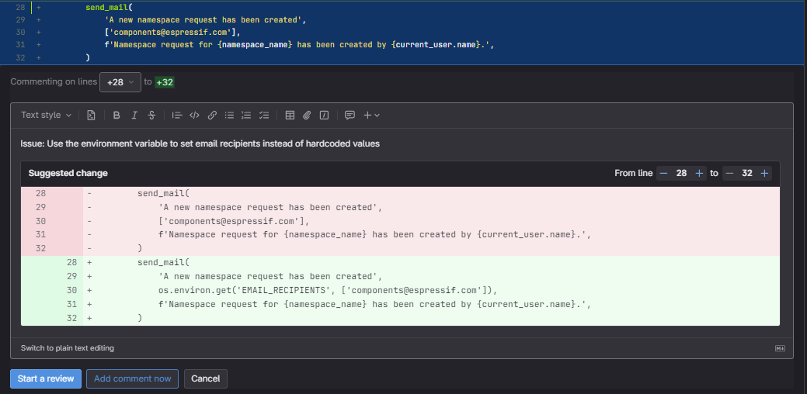

---
# try also 'default' to start simple
theme: default 
# random image from a curated Unsplash collection by Anthony
# like them? see https://unsplash.com/collections/94734566/slidev
#background: https://cover.sli.dev
# some information about your slides, markdown enabled
title: Welcome to Slidev
info: |
  ## Slidev Starter Template
  Presentation slides for developers.

  Learn more at [Sli.dev](https://sli.dev)
# apply any unocss classes to the current slide
class: text-center
# https://sli.dev/custom/highlighters.html
highlighter: shiki
# https://sli.dev/guide/drawing
drawings:
  persist: false
# slide transition: https://sli.dev/guide/animations#slide-transitions
transition: slide-left
# enable MDC Syntax: https://sli.dev/guide/syntax#mdc-syntax
mdc: true
---

<style>
h1 {
  background-color: #2B90B6;
  background-image: linear-gradient(45deg, #4EC5D4 10%, #146b8c 20%);
  background-size: 100%;
  -webkit-background-clip: text;
  -moz-background-clip: text;
  -webkit-text-fill-color: transparent;
  -moz-text-fill-color: transparent;
}

span {
  color: orange;
}
</style>

# Welcome to 

```python
def codeReview(mr: MergeRequest) -> str:
  return f'Nit: This {mr} <- sucks.'
```
<br/>

### And how to make them better

<div class="pt-12">
  <p class="px-2 py-1 rounded cursor-pointer" hover="bg-white bg-opacity-10">
    Daniel Paul 
    <br/>
    (daniel.paul@espressif.com)
  </p>
</div>

<!--
The last comment block of each slide will be treated as slide notes. It will be visible and editable in Presenter Mode along with the slide. [Read more in the docs](https://sli.dev/guide/syntax.html#notes)
-->

---
transition: fade-out
---


# What, why?

**Code reviews** are a systematic examination of computer source code

<v-clicks>

- **Goal**: Find <span>mistakes</span> overlooked in the initial development phase
- **Process**: Developers are looking for <span>bugs</span>, <span>security vulnerabilities</span>, and <span>areas for improvement</span>
- **Benefits**: Improved <span>code quality</span>, better <span>knowledge sharing</span>, increased <span>team collaboration</span>
- **Mentoring**: <span>Teaching developers</span> something new about a language, a framework, or general software design principles
- **Challenges**: <span>Time-consuming</span>, can be stressful
- **Best Practices**: Establish a code review process, set clear goals, and provide constructive feedback

</v-clicks>

<br>
<br>

---
layout: two-cols
layoutClass: gap-16
---

# How?

## Reviewee
<br/>

<v-clicks>

- <span>Prepare your MR</span>. Make sure it's ready for review, don't waste reviewer's time.
- <span>Do a self review</span>. Check for common mistakes, typos, etc. You will find some..
- <span>Understand the feedback</span>. Ask questions if you don't understand something.
- <span>Don't take it personally</span>. It's about the code, not you.
- <span>Be grateful</span>. Acknowledge the feedback.
- <span>Iterate</span>. Make the changes and ask for a re-review.

</v-clicks>

::right::

<br/>
<br/>

## Reviewer

<br/>

<v-clicks>

- <span>Make time</span>. Schedule a time in your day.
- <span>Understand the code</span>. Ask questions if you don't understand something.
  - `Question: How does this work?`
- <span>Provide feedback</span>. **Constructive**, **Specific**, **Polite**.
  - **What's wrong** and **Why** (How to fix it?)
- <span>Acknowledge good stuff</span>. Encourage reviewee!
- <span>Use prefixes</span>:
  - `Nit:` for small things
  - `Suggestion:` for suggestions
  - `Issue:` for bigger issues 

</v-clicks>

---
---

# As a reviewee: Creating a Merge Request

<v-clicks>

- **Title**: Make it <span>descriptive</span>
- **Description**: Explain <span>what the MR does</span>
  - Focus on **what** and **why**, not **how**
  - **How** should be in the code itself (exception for complex logic)
- **Assignee**: Assign the MR to the right person
- **Reviewers**: Assign the MR review to the right people
- **Labels**: Add <span>labels</span> to categorize the MR
- **Testing**: Briefly explain <span>what you tested</span>
- **Screenshots**: Add <span>screenshots</span> if needed
- **Add a link to the JIRA ticket**
  - `* Closes #JIRA_TICKET_NUMBER`

</v-clicks>

---
---

# As a reviewer: What to look for?

<v-clicks>

- **Design**
- **Functionality**
- **Complexity**
- **Naming**
- **Tests**
- **Documentation**

</v-clicks>

---
---

# Design

<v-clicks>

- Does this code <span>comply with our codebase style</span>?
  - **Use linters**
- Does this change <span>integrate well</span> with the rest of the system?
  - **Integration tests**
- Is it a <span>good time</span> to add this feature?
- Is the code <span>easy to understand</span>?
- Is the code <span>DRY</span>? (Don't repeat yourself)
  - **Duplicated functions**

</v-clicks>

---
---


# Functionality

<v-clicks>

- **Think like the user**
- Is the feature <span>working as expected</span>?
  - **Check for conditional statements**
  - **validate all possible code executions**
- Are there any <span>edge cases</span>?
  - **Handle even cases that you are CERTAIN, will not occur**
- Are there any <span>missing error handling</span>?
  - **Handle all exceptions**

</v-clicks>

---
---

# Complexity

<v-clicks>

- Is the code too <span>complex</span>?
  - Too complex: Diffictult to understand quickly by code readers
- Be vary of <span>over-engineering</span> 
  - Over-engineering: Making things too generic, adding functionality that is not needed

</v-clicks>

<br/>

# Naming

<v-clicks>

- Are the names <span>descriptive</span>?
  - "**data**"
- Are the names <span>consistent</span>?
  - "**add_book(...)**", "**create_user(...)**"
- Are the names <span>meaningful</span>?
  - "**stuff**"

</v-clicks>

---
---

# Tests

<v-clicks>

- Is <span>everything meaningful tested</span>?
- Are <span>edge cases tested</span>?
- Are the tests <span>easy to understand</span>?
  - test_stuff()

</v-clicks>

<br/>

# Documentation

<v-clicks>

- Is the code <span>self-explanatory</span>?
  - \[piece.magic() for piece in data\]
- Are there any <span>missing comments</span>?
- Are <span>changes reflected in documentation</span>?
  - **Hey dear users! We would like to share how you can work with our software!**

</v-clicks>

---
---


# Gitlab reviewing

- Click on the *changes* tab
- **Review the diff**
- **Leave comments** on the code by clicking on the line or selecting a block of code
- Steps to leave a comment: 
  - (Optional) Insert suggestion
  - Write a comment -> **`Add comment now`**

---
---

# How could a comment look like

<br/>

<div style="margin-left: 50px; ">
  
</div>

---
---

# Resolving conflicts

<v-clicks>

- **Aspects of software design are almost never a pure style issue or just a personal preference**
- Several ways of doing things are often equally valid
- **If author can demonstrate that his solution is valid, reviewer should accept the preference of author**
- If there is a valid disagreement, try to come to a <span>consensus</span> 
  - Schedule a meeting
  - Talk it through
  - Involve a third party

</v-clicks>

---
---

# Conclusion

<v-clicks>

- **Code reviews are a great way to improve code quality**
- **Learning opportunity for both parties**
- **Improves team collaboration**
- **A way to mentor junior developers**

</v-clicks>

---
---

# Questions?

---
---

# Thank you for your attention!


---
---
# References

- https://google.github.io/eng-practices/review/reviewer/standard.html
